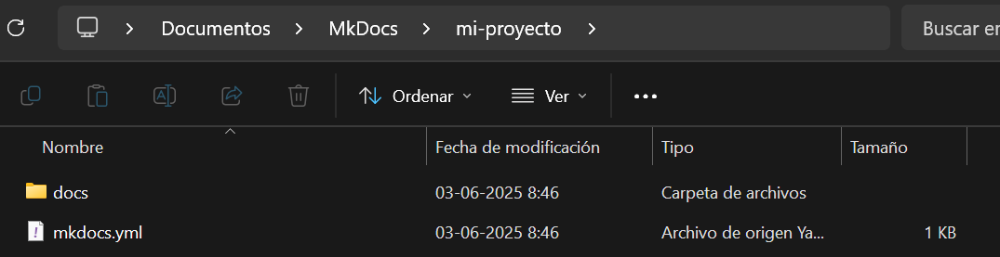
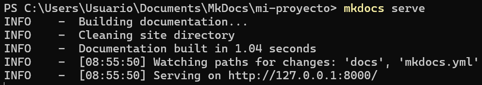
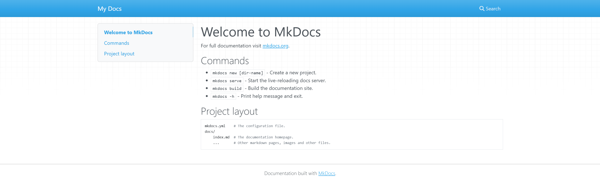

# Creando un proyecto

Abrir una terminal en una carpeta y escribir el siguiente comando:

    mkdocs new mi-proyecto

Luego, para mover la terminal a la carpeta recién creada con el siguiente comando:

    cd my-project

# Desplegando localmente un proyecto

En la terminal abierta, escribir el siguiente comando:

    mkdocs serve

Esto desplegará el proyecto en el enlace indicado, accediendo a este por medio de un navegador se verá el proyecto y podrá editarse a tiempo real.

